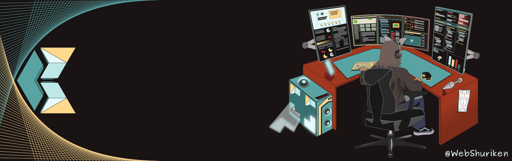

Hola, my name is **Carlos Alford** :octocat:	

## Full Stack developer

Originally from Venezuela, I have always had a real interest in the tech industry and after working as a freelance front-end developer I became curious about the back-end process which lead to successfully joining the School of Code. An intensive coding BootCamp that helped me to fine-tune my problem-solving skills. :man_technologist: During the course, I worked with various tech stacks. I love the whole process, from setting up the backend routes, and creating an API, to making an interface that consumes said API.

I want to support the open source community so if you need help finding that missing semi-colon, creating documentation, or collaborating. Let's connect! :fist_right: :fist_left:

## Tech stack

  
  
  
  
  
  
  
  
  
  
  
  
  
  
  
  
  
  
  
  
  
  
  
  
  
  
  
  

<!-- Working to earn this badges

-->

---

<!-- by: https://github.com/anuraghazra/github-readme-stats -->

  

  

