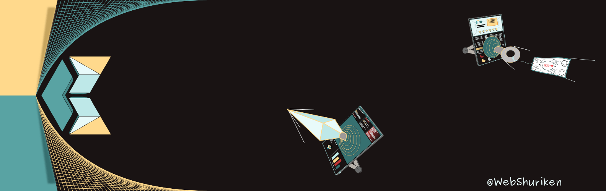

**"New ideas are ready to be devoured and redefined!"**

## Tech stack

  
  
  
  
  
  
  
  
  
  
  
  
  
  
  
  
  
  
  

## Projects tech stats

  

<!-- by: https://github.com/anuraghazra/github-readme-stats

  

  

-->

